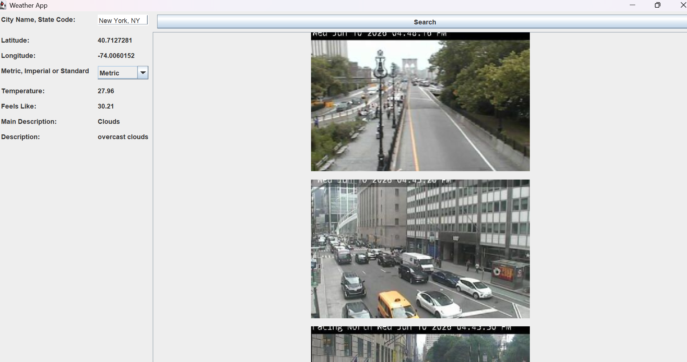

### Weather Service Application

type in a city and its state anywhere in the US and find out the current temperature, what the temperature actually feels like, the weather description, and 5 pictures of that location.

### Screenshots

#### Links

- [Junit Tests](https://junit.org/)
-  [Jcomponent](https://docs.oracle.com/javase/8/docs/api/javax/swing/JComponent.html)
- [GitHub](https://github.com/)
- [Windy API](https://api.windy.com/)
- [Openweathermap](https://openweathermap.org/)
- [OkHttpClient on Square](https://square.github.io/okhttp/3.x/okhttp/okhttp3/OkHttpClient.html)